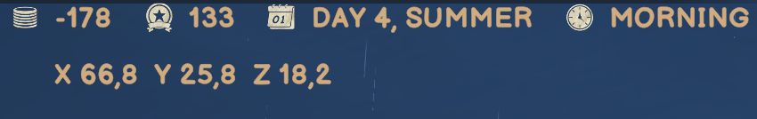

# Coordinates HUD

A mod for Old Market Simulator / Old Market Simulator 模组

[English](#english) · [中文](#中文)

## English

In-game acceptance is confirmed by the maintainer. This version is a stable release; see the [validation record](../releases/validation.md).

See your XYZ position just below the money display, in the same style as the game. The readout updates as you move, including when you are aboard a ship.

[Download 0.1.4](https://github.com/martin-lzh/old-market-simulator-mods/releases/tag/coordinates-v0.1.4)

### Core features

- Display live X/Y/Z coordinates beneath the money bar using the game’s HUD style.
- Keep the readout updated while walking or travelling aboard a ship.
- Toggle the display with F8; hide it automatically when your character is unavailable.

### How to use

- The display starts visible each time you launch the game.
- Press **F8** to hide or show it for the current session.
- The numbers show one decimal place. They describe your position, not map-grid numbers or compass directions.
- The display hides when your character is unavailable, such as before spawning or after disconnecting.

### Install

For Old Market Simulator **2.1.6 on Windows**, with **BepInEx 5** installed.

1. Close the game and back up your save and any older plugin.
2. Extract the Mod ZIP into the game folder. The plugin belongs at `BepInEx/plugins/OldMarket.Coordinates/OldMarket.Coordinates.dll`.
3. Start the game and enter your town.

Choose the Mod ZIP on the release page, not GitHub's **Source code** download. The loader is not included.

### Settings

After the first launch, close the game and open `BepInEx/config/local.oldmarket.coordinates.cfg`.

| Setting | Default | What it does |
| --- | --- | --- |
| `Display.ToggleKey` | F8 | Show/hide key; None disables the shortcut |
| `Display.Visible` | true | Resets to visible when you launch the game |

Older `Left`, `Top` and `FontSize` settings are no longer used; the display follows the money bar. The shortcut is keyboard-only. If F8 is already used by another Mod, choose a different key.

### Compatibility and removal

This Mod only displays your position. It does not move your character or change your inventory or saves, and other players do not need it to see their own game normally. Other HUD Mods may overlap the display; tested combinations are described in the [validation record](../releases/validation.md).

Support for game versions other than 2.1.6 has not been established.

To update, close the game, back up the old DLL and configuration, and replace the DLL. Keep only one active copy. To roll back, close the game and restore those backups. To remove the Mod, close the game and delete `OldMarket.Coordinates.dll` from its plugin folder. Leave your loader and other plugins in place; keeping its configuration preserves your chosen shortcut for a future reinstall.

[What changed](CHANGELOG.md) · [Help and feedback](../SUPPORT.md) · [Development notes](DEVELOPMENT.md) · [License](LICENSE)

## 中文

维护者已确认实机验收完成，本版本为正式发布版，详见[验证记录](../releases/validation.md)。

在金钱栏下方随时查看自己的 XYZ 坐标，字体和样式与游戏保持一致。坐标会跟随移动更新，在船上也能查看。

[下载 0.1.4](https://github.com/martin-lzh/old-market-simulator-mods/releases/tag/coordinates-v0.1.4)

### 核心功能

- 在金钱栏下方以原生界面样式显示实时 X/Y/Z 坐标。
- 步行或乘船时持续更新位置。
- 按 F8 显示／隐藏；角色尚未生成或断线后自动隐藏。

### 怎么操作

- 每次启动游戏时默认显示。
- 按 **F8** 可隐藏或重新显示，本次退出后不保留隐藏状态。
- 坐标保留一位小数，表示实际位置，不是地图格号或东南西北方向。
- 角色尚未出现、断线等暂时没有角色的情况下，显示会自动隐藏。

### 安装

适用于 **Windows 版 Old Market Simulator 2.1.6**，需要先安装 **BepInEx 5**。

1. 退出游戏，备份存档和已有的旧插件。
2. 将 Mod ZIP 解压到游戏目录，确认插件位于 `BepInEx/plugins/OldMarket.Coordinates/OldMarket.Coordinates.dll`。
3. 启动游戏并进入小镇。

请选发布页里的 Mod ZIP，不要下载 **Source code** 当作插件安装。安装包不含加载器。

### 调整设置

首次运行后，退出游戏并打开 `BepInEx/config/local.oldmarket.coordinates.cfg`。

| 设置 | 默认值 | 用途 |
| --- | --- | --- |
| `Display.ToggleKey` | F8 | 显示/隐藏快捷键；None 表示关闭快捷键 |
| `Display.Visible` | true | 每次启动恢复为显示 |

旧版 `Left`、`Top`、`FontSize` 设置不再生效，现在的位置和样式跟随金钱栏。快捷键仅支持键盘；如果 F8 与其他 Mod 冲突，可以换一个按键。

### 兼容与卸载

这个 Mod 只显示位置，不会移动角色、修改库存或存档，也不要求其他玩家安装。其他界面 Mod 可能造成重叠；已测试组合见[验证记录](../releases/validation.md)。

尚未确认 2.1.6 以外的游戏版本兼容性。

更新时先退出游戏，备份旧 DLL 和配置，再替换 DLL，只保留一个启用副本。回退时退出游戏并还原这些备份。卸载时退出游戏，删除插件文件夹中的 `OldMarket.Coordinates.dll` 即可，保留加载器和其他插件；保留配置文件可在重新安装时继续使用原快捷键。

[版本变化](CHANGELOG.md) · [问题反馈](../SUPPORT.md) · [开发说明](DEVELOPMENT.md) · [许可证](LICENSE)
