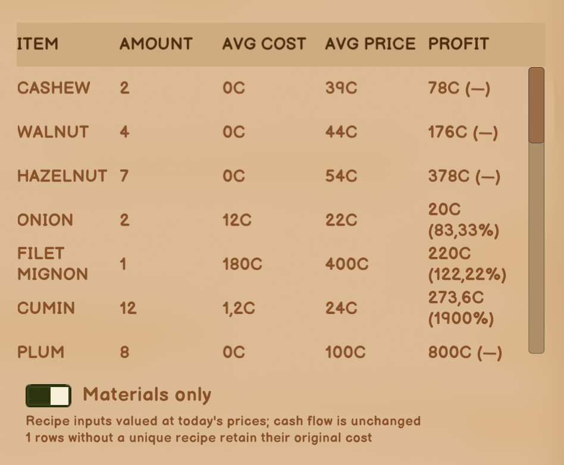
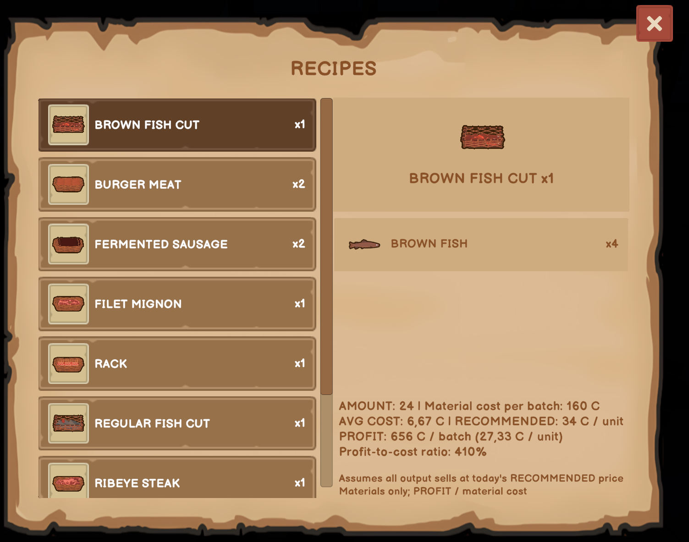
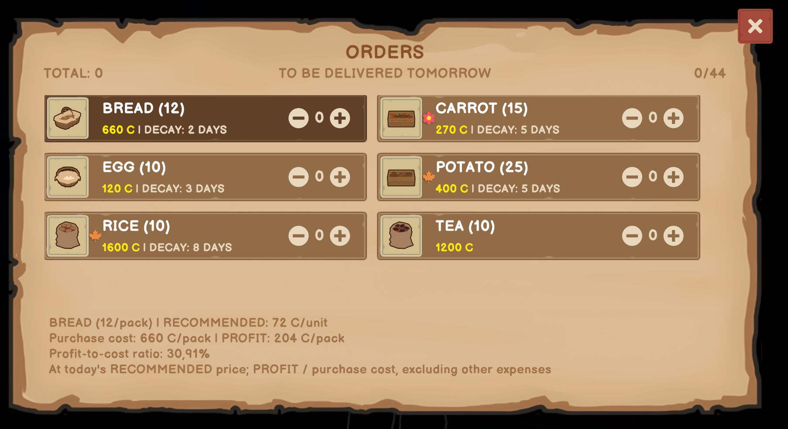

# Profit Insights

A mod for Old Market Simulator / Old Market Simulator 模组

[English](#english) · [中文](#中文)

## English

In-game acceptance is confirmed by the maintainer. This version is a stable release; see the [validation record](../releases/validation.md).

Get a clearer view of material costs and possible profit while making, ordering and selling goods.

[Download 0.5.2](https://github.com/martin-lzh/old-market-simulator-mods/releases/tag/material-cost-v0.5.2)

For Old Market Simulator **2.1.6 on Windows**. Choose the Mod ZIP, not GitHub’s **Source code** download.

### Core features

- Compare ingredient costs and estimated profit in daily reports, recipe details and dock orders.
- Switch the daily report between material estimates and the game’s usual figures.
- See per-item and whole-batch costs, output quantities and suggested-price profit.

### How to use

- **Daily sales report:** turn on **Materials only** to estimate costs from ingredients. Turn it off to return to the game's usual figures; your choice is remembered.
- **Recipe details:** see material cost, output quantity, today's suggested price and estimated profit for each item and the whole batch.
- **Dock orders:** see the suggested selling price, purchase cost and estimated profit for the selected case.

These are display-only estimates. The Mod does not change your money, inventory or selling prices, and it can show estimates for stock you already own.

### What the numbers mean

Costs use today's prices and production rules, not your actual purchase history. Bought and crafted stock use the same estimate.

- Crops include seeds; meat includes the animal consumed to produce it.
- Honey, fruit, milk, eggs and caught fish have zero **material** cost here. Trees, beehives, reusable animals, equipment, labor and running costs are not included.
- Crafted goods use the current wholesale cost of their direct ingredients, rather than working backward through every ingredient's recipe.
- Estimated profit is suggested-price revenue minus the estimated cost. The displayed percentage is **profit divided by cost**, not profit divided by sales revenue.

Zero cost or a missing suggested price displays **—** where a percentage or estimate cannot be calculated. If a product's cost cannot be identified reliably, its report row keeps the game's original figures. These estimates are not your shop's final net profit.

### Installation choices

Use **one** edition to match your loader: BepInEx 5 or MelonLoader 0.7.3. Do not run both loaders together. Close the game before installing.

| Edition | Where the plugin goes |
| --- | --- |
| BepInEx | `BepInEx/plugins/OldMarket.MaterialCost/OldMarket.MaterialCost.dll` |
| MelonLoader | `Mods/OldMarket.MaterialCost.dll` |

Download the matching ZIP from the release page and extract it into the game folder. The loader itself is not included. If you are changing loaders, follow their installation/removal guides first.

### Settings and removal

The report's switch is the easiest way to change the calculation display. After the first launch, close the game before editing settings. BepInEx settings are in `BepInEx/config/local.oldmarket.materialcost.cfg`; MelonLoader settings are in `UserData/OldMarket.MaterialCost.cfg`.

| Setting | BepInEx section/key | MelonLoader category/key | Default |
| --- | --- | --- | --- |
| Estimate report material costs | `Report.MaterialsOnly` | `OldMarketMaterialCost.MaterialsOnly` | false |
| Diagnostic logging | `Diagnostics.Enabled` | `OldMarketMaterialCost.Diagnostics` | false |

Leave diagnostics off unless you are investigating a problem; changes to diagnostics require a restart.

To update, close the game and back up the old DLL and settings before replacing the DLL. Keep only one active copy. To roll back, close the game and restore those backups. To remove the Mod, close the game and delete only `OldMarket.MaterialCost.dll` from the location above; your saves need no conversion. Keep the configuration if you want your settings available after reinstalling.

### Compatibility

Display text follows all 13 game languages, with English fallback for unsupported locales. Native terms such as profit and recommended price use the game's translations.

Only players who want these displays need the Mod. It adds no multiplayer protocol or game-save fields; the recorded host/client test scope is in the [validation record](../releases/validation.md). Other Mods changing the same screens may overlap the text. Support for game versions other than 2.1.6 has not been established.

[What changed](CHANGELOG.md) · [Help and feedback](../SUPPORT.md) · [Development notes](DEVELOPMENT.md) · [License](LICENSE)

## 中文

维护者已确认实机验收完成，本版本为正式发布版，详见[验证记录](../releases/validation.md)。

制作、订货和查看日报时，多一份原料成本与预计利润参考，定价心里更有数。

[下载 0.5.2](https://github.com/martin-lzh/old-market-simulator-mods/releases/tag/material-cost-v0.5.2)

适用于 **Windows 版 Old Market Simulator 2.1.6**。请下载 Mod ZIP，不要把 **Source code** 当作插件安装。

### 核心功能

- 在日报、配方详情和码头订单中查看原料成本与预计利润。
- 日报可切换原料估算与游戏原有统计，并记住选择。
- 同时查看单件与整批成本、产出数量及按建议售价计算的利润。

### 怎么操作

- **每日销售报告：**打开“仅计原料”，按原料估算成本和利润；关闭后恢复游戏原有数字，下次会记住选择。
- **配方详情：**查看每件和整批的原料成本、产量、当天建议售价与预计利润。
- **码头订购页：**查看当前商品的建议售价、整箱进货成本和预计利润。

这里只增加估算显示，不会改变金币、库存或售价。已有库存也能查看，不用重新进货。

### 数字怎么算

估算使用当天价格和生产规则，不是你过去实际花了多少钱；买来的商品与自己制作的商品使用同一口径。

- 种植作物计入种子，肉类计入消耗掉的动物。
- 蜂蜜、水果、牛奶、鸡蛋和钓到的鱼，在这里的**原料成本**记为零；树木、蜂箱、可重复产出的动物、工具、人工和日常经营费用没有计入。
- 加工品按直接原料的当天批发价估算，不逐层展开每种原料的配方。
- 预计利润是建议售价收入减去估算成本；百分比是**利润除以成本**，不是利润除以销售收入。

成本为零或缺少建议售价时，无法计算的百分比或估算会显示 **—**。无法可靠确定成本的商品，在日报中保留游戏原有数字。因此，这些数字不等于店铺最终净利润。

### 选择安装包

按已有加载器选择 **BepInEx 5** 或 **MelonLoader 0.7.3** 版本，二选一，不要同时启用两个加载器。安装前先退出游戏。

| 安装包 | 插件位置 |
| --- | --- |
| BepInEx | `BepInEx/plugins/OldMarket.MaterialCost/OldMarket.MaterialCost.dll` |
| MelonLoader | `Mods/OldMarket.MaterialCost.dll` |

从发布页下载对应 ZIP，解压到游戏目录。包内不含加载器；如果要换加载器，请先按各自的安装和卸载说明处理。

### 设置与卸载

平时直接使用日报里的开关即可。首次运行后，退出游戏再编辑配置：BepInEx 设置位于 `BepInEx/config/local.oldmarket.materialcost.cfg`，MelonLoader 设置位于 `UserData/OldMarket.MaterialCost.cfg`。

| 设置 | BepInEx 分组/键名 | MelonLoader 分类/键名 | 默认值 |
| --- | --- | --- | --- |
| 日报按原料估算成本 | `Report.MaterialsOnly` | `OldMarketMaterialCost.MaterialsOnly` | false |
| 诊断日志 | `Diagnostics.Enabled` | `OldMarketMaterialCost.Diagnostics` | false |

不排查问题时，诊断选项保持关闭；修改诊断设置后需要重启游戏。

更新前退出游戏，备份旧 DLL 和配置后替换 DLL，只保留一个启用副本。回退时退出游戏并还原这些备份。卸载时退出游戏，只删除上表位置的 `OldMarket.MaterialCost.dll`，存档不用转换。保留配置文件即可在重新安装时继续使用原设置。

### 兼容说明

显示文字跟随游戏全部 13 种语言，未支持的语言回退英语；利润、建议售价等原生词条使用游戏译文。

只有需要查看这些信息的玩家才需安装，不新增联机协议或游戏存档字段；已记录的房主／客人测试范围见[验证记录](../releases/validation.md)。其他修改同一界面的 Mod 可能造成文字重叠，尚未确认 2.1.6 以外的游戏版本兼容性。

[版本变化](CHANGELOG.md) · [问题反馈](../SUPPORT.md) · [开发说明](DEVELOPMENT.md) · [许可证](LICENSE)
