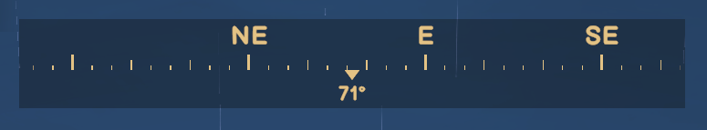
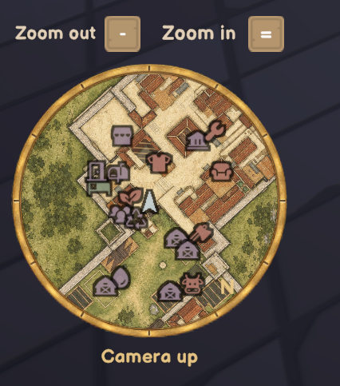
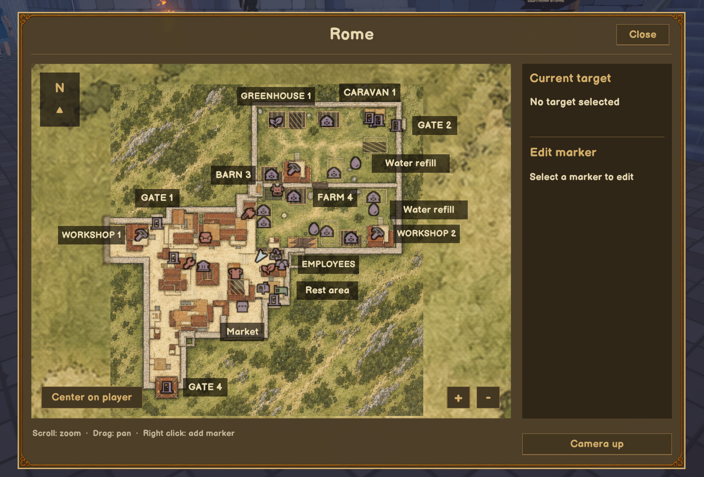
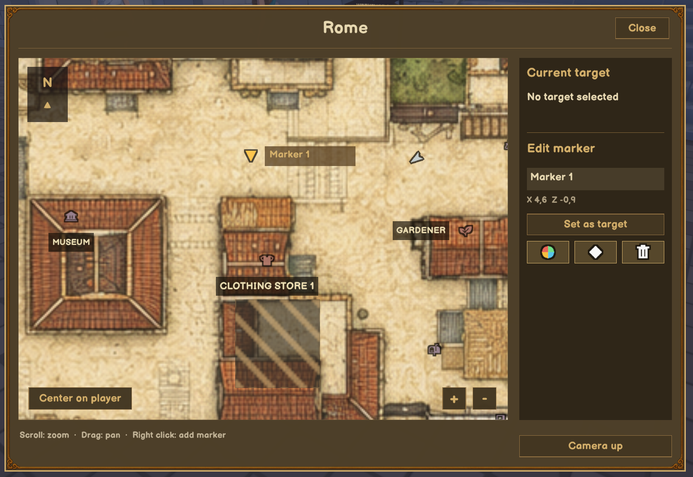
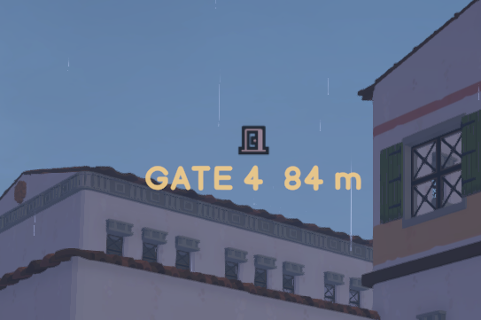

# Map & Compass

A mod for Old Market Simulator / Old Market Simulator 模组

[English](#english) · [中文](#中文)

## English

In-game acceptance is confirmed by the maintainer. This version is a stable release; see the [validation record](../releases/validation.md).

Find your way around town with a minimap, a compass and your own map markers. Map & Compass works independently of the Coordinates HUD Mod.

**Maps: Eastern Town, Island and Rome with seven separate travel regions.**

[Download 0.2.0](https://github.com/martin-lzh/old-market-simulator-mods/releases/tag/navigation-v0.2.0)

### Core features

- Use a minimap, a zoomable large map, a compass and in-world target guidance.
- Explore bundled Eastern Town, Island and Rome maps, including Rome’s seven travel regions.
- Create personal markers with names, colors and icons; navigate to markers or map POIs.
- See supported unlock-area overlays and keep your markers separate for each save and region.

### How to use

| Action | Control |
| --- | --- |
| Open or close the large map | M |
| Close the map | Esc or Close |
| Zoom the large map | Mouse wheel or + / − buttons |
| Move around the map | Hold the left mouse button and drag |
| Zoom the minimap out / in | − / = on the main keyboard row |
| Add a personal marker | Right-click an empty spot on the map |
| Edit a personal marker | Left-click it |
| Remove a personal marker | Right-click it, or use Delete in the editor |
| Navigate to a place | Left- or right-click its icon or name |

The minimap starts in the bottom-left corner. Use the map window's orientation button to switch between north-up and following your view; your choice is remembered. The large map stays north-up. Shop names appear as you zoom in when there is enough room.

One mouse-wheel notch changes the large-map zoom by the same amount as one + / − click. Fractional trackpad movement is preserved. Zoom steps and the closest zoom level adapt to the loaded map's world coverage.

Select a personal marker to change its name, color or shape in the right sidebar. Color and shape buttons open a grid below them—click the one you want. Choose **Set target** to follow it. The compass and in-world guide use the same icon and color as the map. Guides hide while a menu is open and return when it closes.

Opening the map frees the mouse but **does not pause the game**. M is a separate Mod setting; changing the game's map binding does not change this shortcut.

### Install

For Old Market Simulator **2.1.6 on Windows**, with **BepInEx 5** installed.

1. Close the game and back up your save and any older plugin.
2. Extract the Mod ZIP into the game folder. The plugin belongs at `BepInEx/plugins/OldMarket.Navigation/OldMarket.Navigation.dll`.
3. Start the game and enter your town.

Choose the Mod ZIP on the release page, not GitHub's **Source code** download. The loader is not included.

### Map files and saved markers

**The plugin ZIP includes Eastern Town, Island and Rome maps.** Artwork, overlays and map metadata install together with the plugin.

Extract the complete ZIP into the game folder, retaining `BepInEx/plugins/OldMarket.Navigation/maps/`, and restart the game. Eastern Town currently covers the central town and four central-market unlock states, showing cleared market clutter; its outer terrain is not yet bundled. Island is a static surface overview; it does not switch through all market, farm, greenhouse or underground expansions. Rome switches to the local player’s current region after travelling through a gate, caravan or mine entrance. Hatched areas mark pending expansions and clear when their unlock is synchronized. Gate symbols change from a lock to an open door. Shops and facilities appear or move with their unlock state. The mine has two additional stages controlled from the main town. These are surface-area indicators, not a reconstruction of every intermediate building model. Maps do not automatically redraw player placements. Gate 4 now shows the lake west of its central terrace; local in-game testing of the correction in build `921d14b` is complete.

Rome's main map focuses on the walled town and farms, with a margin around the walls. Gates, caravans and the mine retain their separate region maps. The reduced town coverage and unified zoom steps are pending in-game acceptance.

Your markers are personal and kept separately for each save and area. They are not shared with other players. When joining someone else's game, markers last for that connection by default. To keep them between visits, use a different `Markers.RemoteProfile` name for each host's save. Copying or recreating a save folder may make your old markers appear missing. Your selected target is not remembered after restarting.

### Settings

After the first launch, close the game and edit `BepInEx/config/local.oldmarket.navigation.cfg` if you want to change these options.

| Option | Default | What it does |
| --- | --- | --- |
| `Display.Minimap` | true | Show the minimap |
| `Display.Compass` | true | Show the compass |
| `Display.TargetGuidance` | true | Show target icons on the compass and in the world |
| `Display.Coordinates` | false | Show XYZ below the compass; leave off if using Coordinates HUD |
| `Display.CameraUp` | false | Make the minimap follow your view |
| `Display.ReflowNativeHud` | true | Move nearby game messages away from the navigation display |
| `Input.MapKey` | M | Change the map key; None turns the shortcut off |
| `Markers.RemoteProfile` | empty | Keep markers for a particular friend's save |

To adjust size or position, edit `BepInEx/config/OldMarket.Navigation/layout.json`. Changes appear while you play. `MinimapSize` changes the frame size; `MinimapRange` changes how much ground it shows (default 75; smaller means closer). `MinimapLeft` and `MinimapBottom` move it away from the left and bottom edges. Back up the file before editing so you can easily undo a change.

### A few things to know

The interface, built-in map titles and functional place labels follow all 13 game languages: English, Simplified Chinese, Traditional Chinese, German, French, Italian, Japanese, Korean, Portuguese, Russian, Spanish, Turkish and Ukrainian. Verified place names use the game's translations; rest areas, markets, water refill, calendars and return entrances use original Mod translations. Unknown languages fall back to English for Mod text. Your own marker names stay as written.

Target icons show a direction, not a walking route. They may appear through buildings or over a roof. Map north is a consistent Mod convention and may differ from other maps. Overlays from Steam or performance tools may still cover the display.

### Updating or removing

Close the game and back up the plugin before replacing its DLL and bundled maps. Keep `BepInEx/config/OldMarket.Navigation/` and `BepInEx/config/local.oldmarket.navigation.cfg` to preserve your markers and settings. To remove the Mod, delete its DLL; you can also remove its map folder if you no longer need it. Restore your backed-up DLL and settings to go back to an earlier version.

[What changed](CHANGELOG.md) · [Help and feedback](../SUPPORT.md) · [License](LICENSE)

## 中文

维护者已确认实机验收完成，本版本为正式发布版，详见[验证记录](../releases/validation.md)。

用小地图、罗盘和自己的标记点，轻松找到镇上的目的地。Map & Compass 可以独立使用，不需要安装 Coordinates HUD。

**地图：东方小镇、海岛，以及包含七个独立传送区域的罗马小镇。**

[下载 0.2.0](https://github.com/martin-lzh/old-market-simulator-mods/releases/tag/navigation-v0.2.0)

### 核心功能

- 提供小地图、可缩放大地图、罗盘和场景内目标指引。
- 内置东方小镇、海岛及罗马地图，包含罗马七个传送区域。
- 创建带名称、颜色和图标的个人标记，或直接前往地图地点。
- 显示受支持的解锁区域覆盖层，标记按存档和区域分别保存。

### 怎么操作

| 操作 | 按键或鼠标操作 |
| --- | --- |
| 打开或关闭大地图 | M |
| 关闭大地图 | Esc 或“关闭” |
| 缩放大地图 | 滚轮或 + / − 按钮 |
| 拖动地图 | 按住鼠标左键拖动 |
| 缩小 / 放大小地图 | 主键盘的 − / = |
| 添加个人标记 | 右键地图空白处 |
| 编辑个人标记 | 左键标记 |
| 删除个人标记 | 右键标记，或点击编辑区的删除按钮 |
| 前往店铺等地点 | 左键或右键它的图标或名称 |

小地图默认在左下角。大地图窗口中的朝向按钮可以切换“固定正北”和“随视角转动”，下次进入也会记住选择。大地图始终保持正北朝上。放大地图后，空间足够的地点会显示名称。

大地图滚轮每滚动一格，与点击一次 + / − 按钮的缩放幅度相同；触控板的小数滚动仍然有效。缩放步长与放大上限会适应所加载地图的世界覆盖范围。

选中个人标记后，可以在右侧改名称、颜色和图标。点击颜色或图标按钮，下方会展开选择格，点哪个就用哪个。点击“设为目标”即可跟随指引，罗盘和场景内会显示与地图相同的图标和颜色。打开菜单时指引会暂时隐藏，关闭后恢复。

打开地图后可以自由使用鼠标，但**游戏不会暂停**。M 是本 Mod 的独立设置，不会跟随游戏里的地图改键。

### 安装

适用于 **Windows 版 Old Market Simulator 2.1.6**，需要先安装 **BepInEx 5**。

1. 退出游戏，备份存档和已有的旧插件。
2. 将 Mod ZIP 解压到游戏目录，确认插件位于 `BepInEx/plugins/OldMarket.Navigation/OldMarket.Navigation.dll`。
3. 启动游戏并进入小镇。

请选发布页里的 Mod ZIP，不要下载 **Source code** 当作插件安装。安装包不含加载器。

### 地图文件与标记保存

**插件 ZIP 已包含东方小镇、海岛与罗马地图。**底图、覆盖层和地图元数据会随插件一起安装。

将整个 ZIP 解压到游戏目录，保留 `BepInEx/plugins/OldMarket.Navigation/maps/`，再重启游戏。东方小镇目前覆盖镇区及中央市场四种解锁状态，可反映市场垃圾清理，外围地形尚未打包；海岛是静态地表概览，不随市场、农场、温室或地下扩建的全部状态切换。罗马会在穿过大门、乘坐商队或进入矿洞后，切换到本地玩家所在区域的地图。斜线阴影表示待解锁扩建范围，同步解锁后消失；大门图标由锁变为开放入口，店铺和设施图标随启停状态出现或移动。矿洞另含由主城控制的两个扩建阶段。这些是地表范围提示，不逐一重建各阶段建筑模型；地图不会自动重画玩家摆放物。大门4底图已补回中央长平台西侧的湖泊；修正构建 `921d14b` 的本地实机测试已完成。

罗马主地图聚焦城墙内的镇区与农田，并在城墙外保留余量；大门、商队与矿洞继续使用各自的区域地图。本次主城范围收紧与统一缩放步长仍待实机验收。

个人标记按存档和区域分别保存，不会分享给其他玩家。加入好友房间时，默认只保留本次连接中的标记。如果想下次继续使用，请为每位好友的存档设置不同的 `Markers.RemoteProfile` 名称。复制或重建存档文件夹后，旧标记可能暂时找不到。当前选中的目标不会在重启后保留。

### 调整设置

首次运行后，退出游戏，打开 `BepInEx/config/local.oldmarket.navigation.cfg` 即可调整。

| 设置 | 默认值 | 用途 |
| --- | --- | --- |
| `Display.Minimap` | true | 显示小地图 |
| `Display.Compass` | true | 显示罗盘 |
| `Display.TargetGuidance` | true | 显示罗盘和场景内的目标图标 |
| `Display.Coordinates` | false | 在罗盘下显示 XYZ；使用 Coordinates HUD 时建议关闭 |
| `Display.CameraUp` | false | 小地图随视角转动 |
| `Display.ReflowNativeHud` | true | 将附近游戏消息挪开，减少遮挡 |
| `Input.MapKey` | M | 地图快捷键；None 表示关闭快捷键 |
| `Markers.RemoteProfile` | 留空 | 为某个好友存档保留标记 |

位置和大小可在 `BepInEx/config/OldMarket.Navigation/layout.json` 中调整，游玩时也能看到变化。`MinimapSize` 调整外框大小，`MinimapRange` 调整显示范围（默认 75，越小看得越近），`MinimapLeft` 和 `MinimapBottom` 调整与屏幕左边、底边的距离。修改前留一份备份，方便还原。

### 使用时留意

界面、内置地图标题及功能地点标签支持游戏全部 13 种语言：英语、简中、繁中、德语、法语、意大利语、日语、韩语、葡萄牙语、俄语、西班牙语、土耳其语和乌克兰语。已确认的地点名使用游戏译文，休息处、市场、补水处、日历及返回入口使用 Mod 原创翻译；未知语言的 Mod 文字回退英语。自己填写的标记名称保持原样。

目标图标提供方向，不是可行走路线；可能透过建筑显示，也可能落在屋顶上。地图北向使用本 Mod 的统一约定，可能与其他地图不同。Steam 或性能工具的覆盖层仍可能挡住界面。

### 更新与卸载

退出游戏并备份旧插件后，替换本 Mod 的 DLL 和随包地图。保留 `BepInEx/config/OldMarket.Navigation/` 和 `BepInEx/config/local.oldmarket.navigation.cfg`，就能留下标记和设置。卸载时删除 DLL；地图文件不用了也可以移除。需要退回旧版时，还原备份的 DLL 和设置即可。

[版本变化](CHANGELOG.md) · [问题反馈](../SUPPORT.md) · [许可证](LICENSE)

Map icons / 地图图标：[Phosphor](assets/phosphor/README.md)，MIT。
