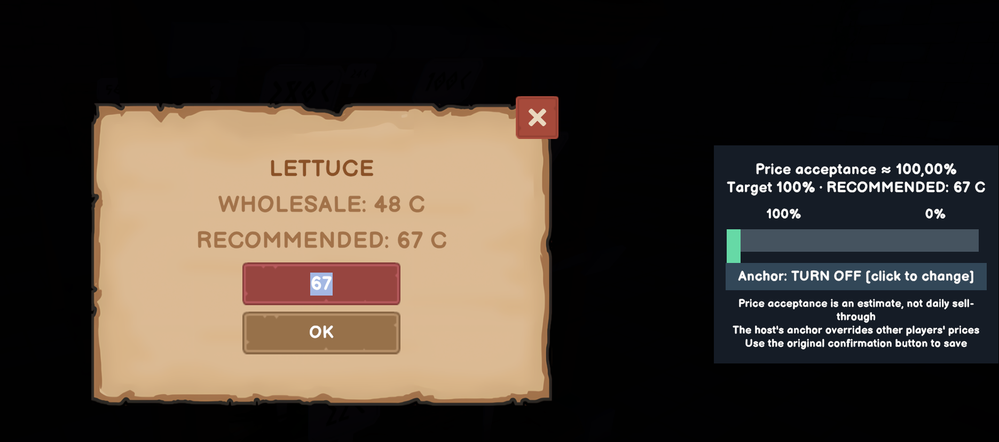
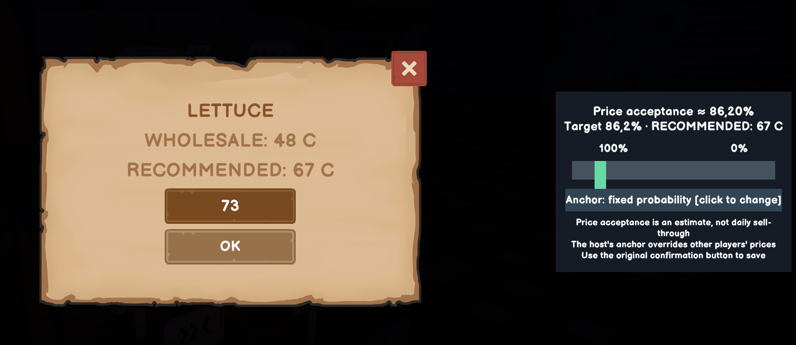

# Smart Pricing

A mod for Old Market Simulator / Old Market Simulator 模组

[English](#english) · [中文](#中文)

## English

In-game acceptance is confirmed by the maintainer. This version is a stable release; see the [validation record](../releases/validation.md).

See how likely customers are to accept a price, then choose whether to keep a fixed price or a fixed acceptance chance.

[Download 0.1.2](https://github.com/martin-lzh/old-market-simulator-mods/releases/tag/price-probability-v0.1.2)

### Core features

- Preview the chance that a customer accepts a price in the normal pricing panel.
- Adjust the price or target acceptance chance and see the corresponding estimate.
- Let the host keep a fixed price or automatically maintain a target acceptance chance as wholesale prices change.

### How to use

- Open the game's price panel. Changing the price updates the chance; moving the chance slider suggests a matching price.
- Choose **Off**, **Fixed price** or **Fixed probability**. Fixed probability adjusts prices when the game's wholesale prices change.
- A 100% target uses the game's suggested price for that day.
- Use the game's **Confirm** button to save. Closing the panel without confirming discards your unsaved rule changes.

Drag the acceptance slider to update the selling-price field, then choose **Fixed probability** to maintain that target as wholesale prices change. Press the game's confirmation button to save.

The percentage means a customer who has found the product will not reject it for being too expensive. **It is not the chance of selling all your stock.** Demand, customer traffic, freshness and stock still matter. Prices use whole numbers, so the actual estimate can differ from the requested chance, especially for cheap products.

### Install

For Old Market Simulator **2.1.6 on Windows**, with **BepInEx 5** installed.

1. Close the game and back up your save and any older plugin.
2. Extract the Mod ZIP into the game folder. The plugin belongs at `BepInEx/plugins/OldMarket.PriceProbability/OldMarket.PriceProbability.dll`.
3. Start the game and enter your town.

Choose the Mod ZIP on the release page, not GitHub's **Source code** download. The loader is not included.

Keep only one copy of this plugin DLL under `BepInEx/plugins`, including any older copy installed directly in that folder. Other game versions and platforms have not been confirmed compatible.

### Multiplayer

Only the host can keep and apply automatic pricing rules. Other players can preview prices if they have the Mod; they can still use the normal pricing screen without it. A host's active rule takes precedence over a guest's price change, and guests without the Mod cannot see that rule. Reopen a price panel to see changes made by someone else.

Rules stay on the host's computer. Avoid using another automatic-pricing Mod at the same time.

### Settings and removal

Manage rules in the price panel. They are saved by game save slot in `BepInEx/config/local.oldmarket.priceprobability.cfg`. If you replace a save with a different one in the same slot, clear its old rules first so they do not carry over unexpectedly.

To clear one product's rule, select **Off** in its price panel and press **Confirm**. To reset rules for every slot, close the game, back up the configuration file and move it out of `BepInEx/config`; the Mod recreates it without rules when needed. Configuration changes do not restore earlier selling prices. When transferring a world to another host or computer, the rules do not travel with the game save; set them up again or deliberately transfer the matching configuration as well.

To update, close the game and back up the old DLL and settings before replacing the plugin. To uninstall, close the game and remove `OldMarket.PriceProbability.dll`. Automatic changes stop, but prices already set remain until you change them. Keep your loader and other plugins.

[What changed](CHANGELOG.md) · [Help and feedback](../SUPPORT.md) · [Development and validation](DEVELOPMENT.md) · [Translations](localization/README.md) · [License](LICENSE)

## 中文

维护者已确认实机验收完成，本版本为正式发布版，详见[验证记录](../releases/validation.md)。

定价时直接看看顾客愿不愿意买，还可以选择固定售价或固定接受概率，让价格随行情调整。

[下载 0.1.2](https://github.com/martin-lzh/old-market-simulator-mods/releases/tag/price-probability-v0.1.2)

### 核心功能

- 在原生定价面板预览顾客接受该价格的概率。
- 调整价格或目标接受率，查看对应估算。
- 房主可设置固定价格，或随批发价变化自动维持目标接受率。

### 怎么操作

- 打开游戏的定价页，修改售价会更新概率，拖动概率滑条则会给出相应售价。
- 可选“关闭”“固定售价”或“固定概率”；固定概率会在批发价格变化时重新调整售价。
- 100% 目标使用游戏当天的建议售价。
- 点击游戏原有的**确认按钮**保存；直接关闭页面会丢弃尚未确认的规则修改。

拖动接受概率滑条会同步更新售价输入框，再选择“固定概率”，即可随批发价变化维持目标接受率。最后点击游戏原有的确认按钮保存。

这里的概率指顾客已经找到商品后，不会因为太贵而放弃购买的可能性，**不是当天卖光库存的概率**。需求、客流、保鲜和库存依然影响销量。售价只能是整数，因此实际概率可能与目标略有差异，低价商品尤其明显。

### 安装

适用于 **Windows 版 Old Market Simulator 2.1.6**，需要先安装 **BepInEx 5**。

1. 退出游戏，备份存档和已有的旧插件。
2. 将 Mod ZIP 解压到游戏目录，确认插件位于 `BepInEx/plugins/OldMarket.PriceProbability/OldMarket.PriceProbability.dll`。
3. 启动游戏并进入小镇。

请选发布页里的 Mod ZIP，不要下载 **Source code** 当作插件安装。安装包不含加载器。

`BepInEx/plugins` 下只保留一份本插件 DLL，包括以前直接放在该目录里的旧副本。其他游戏版本和平台尚未确认兼容。

### 和朋友一起玩

只有房主能保存和执行自动定价规则。客人安装后可以查看概率，不安装也能使用游戏原有定价页。房主开启的规则会优先于客人的改价；未安装的客人看不到规则状态。别人改价后，重新打开定价页即可查看。

规则保存在房主电脑上，尽量不要同时使用其他自动定价 Mod。

### 设置与卸载

平时直接在定价页管理规则即可。规则按存档槽保存在 `BepInEx/config/local.oldmarket.priceprobability.cfg`；如果把同一个槽换成另一份存档，请先清除旧规则，避免意外沿用。

清除单个商品规则时，在其定价页选择**关闭**并点击**确认**。若要重置所有存档槽的规则，请退出游戏，备份配置文件后将它移出 `BepInEx/config`；Mod 会在需要时重新生成不含规则的配置。修改配置不会恢复此前的售价。将世界转给另一位房主或另一台电脑时，规则不会随游戏存档迁移；需要重新设置，或同时迁移与该存档匹配的配置。

更新前退出游戏，备份旧 DLL 和设置后替换插件。卸载时退出游戏并删除 `OldMarket.PriceProbability.dll`，自动调价会停止，但已经设置的售价会保留，需要时可自行修改。保留加载器和其他插件。

[版本变化](CHANGELOG.md) · [问题反馈](../SUPPORT.md) · [开发与验证](DEVELOPMENT.md) · [翻译说明](localization/README.md) · [许可证](LICENSE)
