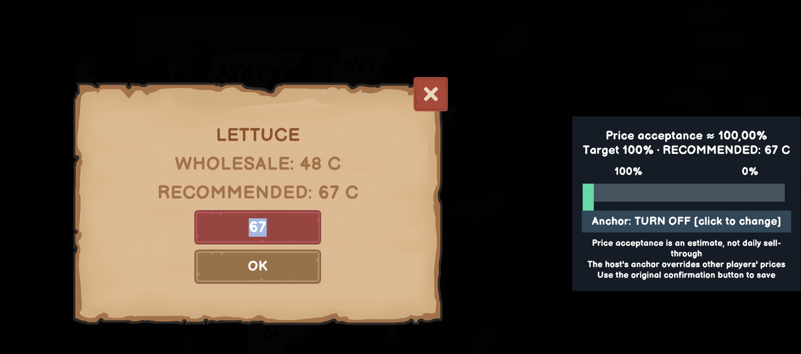
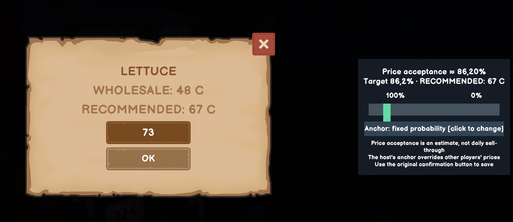

# Smart Pricing

A mod for Old Market Simulator / Old Market Simulator 模组

[English](#english) · [中文](#中文)

## English

See how likely customers are to accept a price, then choose whether to keep a fixed price or a fixed acceptance chance.

[Download 0.1.3](https://github.com/martin-lzh/old-market-simulator-mods/releases/tag/price-probability-v0.1.3)

### Game compatibility and testing

Supports **Old Market Simulator 2.1.6 on Windows**.

2026-09-14: Smart Pricing 0.1.2 completed local and two-computer multiplayer testing on Old Market Simulator 2.1.6. Version 0.1.3 retains that gameplay and updates the licence and documentation.

### Core features

- Preview the chance that a customer accepts a price in the normal pricing panel.
- Adjust the price or target acceptance chance and see the corresponding estimate.
- Let the host keep a fixed price or automatically maintain a target acceptance chance as wholesale prices change.

### How to use

1. Open the game's price panel. Changing the price updates the chance; dragging the chance slider fills in a matching price.
2. Choose a rule: **Off**, **Fixed price** or **Fixed probability**. Fixed probability re-prices the product whenever wholesale prices change. A 100% target uses the game's suggested price for the day.
3. Press the game's **Confirm** button to save. Closing the panel without confirming discards the changes.

The percentage is the chance that a customer who has found the product accepts the price. How much you sell still depends on demand, customer traffic, freshness and stock. Prices are whole numbers, so the actual chance can land slightly off the target, most noticeably on cheap products.

### Install

Requires **Old Market Simulator 2.1.6 on Windows x64**. **BepInEx 5** is a free loader that runs Mods when the game starts. Install it once; it is not included in the Mod ZIP.

1. Exit the game. In **Steam → Library**, right-click **Old Market Simulator → Manage → Browse local files**. Keep this game folder open; it contains the game program and its `_Data` folder.
2. Open the [official BepInEx 5.4.23.5 release](https://github.com/BepInEx/BepInEx/releases/tag/v5.4.23.5), expand **Assets** and click **BepInEx_win_x64_5.4.23.5.zip**. If BepInEx 5 already runs your Mods, skip to step 5.
3. Open **Downloads** in File Explorer, right-click the loader ZIP and choose **Extract All → Extract**. Copy the extracted `BepInEx` folder, `winhttp.dll` and `doorstop_config.ini` into the game folder, next to the game program. Do not put them inside another BepInEx folder.
4. Start the game from Steam, wait for the main menu, then exit. The game folder's `BepInEx` folder now contains `plugins` and `config`.
5. Open [this Mod's Nexus Files page](https://www.nexusmods.com/oldmarketsimulator/mods/48?tab=files), choose **Main files → Manual download**, then **Slow download** with a free account. Alternatively, open [GitHub 0.1.3](https://github.com/martin-lzh/old-market-simulator-mods/releases/tag/price-probability-v0.1.3) and under **Assets** download **OldMarket.PriceProbability-0.1.3.zip**, not **Source code**.
6. In **Downloads**, right-click the Mod ZIP → **Extract All → Extract**. Copy its entire `BepInEx` folder into the game folder and allow Windows to merge the folders. The final plugin path is `BepInEx/plugins/OldMarket.PriceProbability/OldMarket.PriceProbability.dll`. Keep only one copy of this DLL under `BepInEx/plugins`.
7. Start the game from Steam and load your town. Open a product price label and check the displayed acceptance chance.

If it does not appear, exit the game and check the path in step 6. From the game folder, open **BepInEx**, right-click **LogOutput.log → Open with → Notepad**, and find the error or this Mod's name. Include the relevant lines with [your report](https://github.com/martin-lzh/old-market-simulator-mods/issues).

### Multiplayer

Pricing rules are saved and applied by the host. Guests with the Mod can preview chances; guests without it use the normal pricing screen. The host's rules win over a guest's price change. Reopen a price panel to see changes made by someone else.

Don't run another automatic-pricing Mod at the same time.

### Managing rules

Rules are set in the price panel and saved per save slot in `BepInEx/config/local.oldmarket.priceprobability.cfg`.

- **Clear one product's rule:** select **Off** in its price panel and press **Confirm**.
- **Reuse a save slot for a different save:** clear the old rules first so they don't carry over.
- **Reset all rules:** close the game and move the configuration file out of `BepInEx/config` (keep it as a backup). A fresh one is created when needed.
- **Move a world to another host or computer:** set the rules up again there, or copy this configuration file along with the save.

### Updating or removing

To update, close the game, back up the old DLL and settings, then replace the plugin. To uninstall, delete `OldMarket.PriceProbability.dll`. Automatic re-pricing stops, and products keep their current prices.

[What changed](CHANGELOG.md) · [Help and feedback](https://github.com/martin-lzh/old-market-simulator-mods/blob/main/SUPPORT.md) · [Development notes](https://github.com/martin-lzh/old-market-simulator-mods/blob/main/price-probability-mod/DEVELOPMENT.md) · [Translations](https://github.com/martin-lzh/old-market-simulator-mods/blob/main/price-probability-mod/localization/README.md) · [License](LICENSE)

## 中文

定价时直接看看顾客愿不愿意买，还可以选择固定售价或固定接受概率，让价格随行情调整。

[下载 0.1.3](https://github.com/martin-lzh/old-market-simulator-mods/releases/tag/price-probability-v0.1.3)

### 游戏兼容性与测试

支持 **Windows 版 Old Market Simulator 2.1.6**。

2026-09-14：Smart Pricing 0.1.2 在 Old Market Simulator 2.1.6 完成本地及双电脑联机测试；0.1.3 沿用该版本玩法，更新许可和文档。

### 核心功能

- 在原生定价面板预览顾客接受该价格的概率。
- 调整价格或目标接受率，查看对应估算。
- 房主可设置固定价格，或随批发价变化自动维持目标接受率。

### 怎么操作

1. 打开游戏的定价页。修改售价会更新概率，拖动概率滑条会自动填入对应售价。
2. 选择规则：“关闭”“固定售价”或“固定概率”。固定概率会在批发价变化时自动重新定价；目标为 100% 时使用游戏当天的建议售价。
3. 点击游戏原有的**确认**按钮保存。不确认直接关闭会放弃本次修改。

这里的概率是顾客找到商品后愿意接受这个价格的可能性。实际卖出多少，还取决于需求、客流、保鲜和库存。售价只能是整数，所以实际概率会与目标略有出入，低价商品更明显。

### 安装

需要 **Windows x64 版 Old Market Simulator 2.1.6**。**BepInEx 5** 是在游戏启动时运行 Mod 的免费加载器，只需安装一次，Mod ZIP 不包含加载器。

1. 退出游戏。在 **Steam → 库** 中右键 **Old Market Simulator → 管理 → 浏览本地文件**。保持此游戏文件夹打开，里面应有游戏程序及其 `_Data` 文件夹。
2. 打开 [BepInEx 5.4.23.5 官方发布页](https://github.com/BepInEx/BepInEx/releases/tag/v5.4.23.5)，展开 **Assets（附件）**，点击 **BepInEx_win_x64_5.4.23.5.zip**。如果 BepInEx 5 已能运行 Mod，从第 5 步开始。
3. 在资源管理器中打开 **下载**，右键加载器 ZIP → **全部解压缩 → 提取**。把解压后的 `BepInEx` 文件夹、`winhttp.dll` 和 `doorstop_config.ini` 复制到游戏文件夹，与游戏程序同层。不要再多套一层 BepInEx 文件夹。
4. 从 Steam 启动游戏，等到主菜单后退出。此时游戏文件夹中的 `BepInEx` 下会出现 `plugins` 和 `config` 文件夹。
5. 打开 [本 Mod 的 Nexus 文件页](https://www.nexusmods.com/oldmarketsimulator/mods/48?tab=files)，选择 **Main files（主要文件）→ Manual download（手动下载）**；免费账号选择 **Slow download（慢速下载）**。也可打开 [GitHub 0.1.3](https://github.com/martin-lzh/old-market-simulator-mods/releases/tag/price-probability-v0.1.3)，在 **Assets（附件）** 下载 **OldMarket.PriceProbability-0.1.3.zip**，不要选 **Source code（源码）**。
6. 在 **下载** 中右键 Mod ZIP → **全部解压缩 → 提取**。把里面的整个 `BepInEx` 文件夹复制到游戏文件夹，让 Windows 合并目录。插件最终应位于 `BepInEx/plugins/OldMarket.PriceProbability/OldMarket.PriceProbability.dll`，`BepInEx/plugins` 下只保留一份此 DLL。
7. 从 Steam 启动游戏并载入城镇。打开商品价格标签，查看显示的价格接受概率。

不生效时先退出游戏，检查第 6 步的路径。从游戏文件夹进入 **BepInEx**，右键 **LogOutput.log → 打开方式 → 记事本**，查找报错或 Mod 名称。将相关日志行附在[问题反馈](https://github.com/martin-lzh/old-market-simulator-mods/issues)中。

### 和朋友一起玩

定价规则由房主保存和执行。安装了 Mod 的客人可以查看概率，没安装的客人照常使用游戏定价页。房主的规则优先于客人的改价。别人改价后，重新打开定价页即可看到。

请不要同时使用其他自动定价 Mod。

### 管理规则

规则在定价页设置，按存档槽保存在 `BepInEx/config/local.oldmarket.priceprobability.cfg`。

- **清除单个商品的规则：**在其定价页选择**关闭**并点击**确认**。
- **同一存档槽换成另一份存档：**先清除旧规则，避免沿用。
- **重置全部规则：**退出游戏，把配置文件移出 `BepInEx/config`（留作备份），需要时会自动生成新文件。
- **把世界转给另一位房主或另一台电脑：**在新位置重新设置规则，或连同存档一起复制这个配置文件。

### 更新与卸载

更新时退出游戏，备份旧 DLL 和设置后替换插件。卸载时删除 `OldMarket.PriceProbability.dll`；自动调价随之停止，商品保持当前售价。

[版本变化](CHANGELOG.md) · [问题反馈](https://github.com/martin-lzh/old-market-simulator-mods/blob/main/SUPPORT.md) · [开发说明](https://github.com/martin-lzh/old-market-simulator-mods/blob/main/price-probability-mod/DEVELOPMENT.md) · [翻译说明](https://github.com/martin-lzh/old-market-simulator-mods/blob/main/price-probability-mod/localization/README.md) · [许可证](LICENSE)
