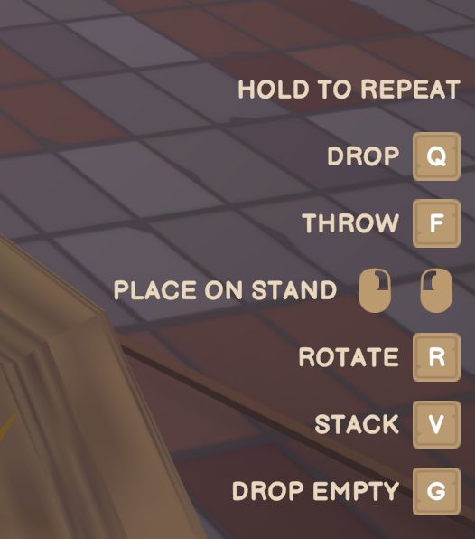
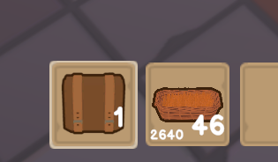

# Better Stacking

A mod for Old Market Simulator / Old Market Simulator 模组

[English](#english) · [中文](#中文)

## English

In-game acceptance is confirmed by the maintainer. This version is a stable release; see the [validation record](../releases/validation.md).

Carry more without losing track of your baskets and boxes. Each product slot can hold up to 64 containers; tools stay separate.

[Download 0.3.0](https://github.com/martin-lzh/old-market-simulator-mods/releases/tag/stack-all-v0.3.0)

### Core features

- Carry up to 64 containers or seed packets per slot while preserving each container’s contents, cost and freshness.
- See goods and physical container counts separately; stack ordinary collectibles too.
- Drop or throw one at a time, or hold to repeat through the selected stack.
- Use G to remove only empty reusable containers without discarding filled or partly filled ones.

### How to use

- Tap Q to drop one item or one complete container; tap F to throw one. Mouse placement also handles one at a time.
- Hold Q or F to continue through the selected slot, starting after about 0.6 seconds. When multiple items remain, “HOLD TO REPEAT” appears above the controls using the game’s own font and layout; it also applies to G.
- Tap G to drop one empty reusable basket/box from the selected slot; hold G for 0.6 seconds to repeat every 0.12 seconds. Filled and partly filled containers remain. For reusable containers, the G hint uses the native caption/keycap format beside the existing controls and dims as a whole when no empty is available. Seed packets and disposable packaging are excluded. G is a fixed keyboard shortcut; avoid assigning another inventory action to G.
- Q/F follow your game key bindings; G uses the fixed shortcut. Switching slots/items, opening a menu, pausing, switching windows or pressing both actions stops the sequence.

There are no settings to adjust before playing.

### Install

For Old Market Simulator **2.1.6 on Windows**, with **BepInEx 5** installed.

1. Close the game and back up your save and any older plugin.
2. Extract the Mod ZIP into the game folder. The plugin belongs at `BepInEx/plugins/OldMarket.StackAll/OldMarket.StackAll.dll`.
3. Start the game and enter your town.

Choose the Mod ZIP on the release page, not GitHub's **Source code** download. The loader is not included.

Keep only one copy of this plugin DLL under `BepInEx/plugins`, including any older copy installed directly in that folder. Other game versions and platforms have not been confirmed compatible. If the game assembly changes, Better Stacking disables itself and reports the compatibility error in `BepInEx/LogOutput.log`. Preserve your backup and check for a compatible release before loading a save that needs the Mod.

### How stacks work

The bottom-left number is the amount of goods; the bottom-right is the number of containers. Two baskets with 24 goods each show **48 goods / 2 containers**. Empty baskets still count as containers. Whole fish and other single-use, one-unit products show only their quantity on the right. One- and two-digit quantities keep the native font size; larger goods totals fit in the left half.

Each container keeps its contents, cost and freshness. Compatible goods use the game's usual merging and expiry rules. Other non-tool items stack up to 64. A 65th container goes into another available slot; if there is no room, it stays near you.

Seed packets also stack up to 64 per slot. The left number counts seeds and the right counts packets. Drop, throw and placement move one complete packet, including a partially used one; planting still uses one seed. Packets retain their individual contents and cost without transferring seeds between packets. Seed quantities already merged by an older build remain one packet with their saved quantity; their original packet count cannot be recovered.

Ordinary collectibles such as mint leaves and flowers can rejoin their matching stack after being dropped, even when their time on the ground differs. Animals and fish traps still require matching age/use state; food retains its freshness rules.

### Multiplayer

**Everyone in the room, including the host, needs the same Better Stacking version.** Please compare versions before joining; the Mod does not check this for you. Avoid combining it with other Mods that change inventory stacking.

### Backups and removal

**Back up your save before installing. Saves containing extra containers need Better Stacking 0.2.0 or a later compatible version. Do not simply remove the Mod while those containers remain.**

To remove it or return to an incompatible older version:

1. With Better Stacking still installed, take out extra containers until each product slot has at most one.
   Do the same for seed packets. Use up any seed packet exceeding the native packet size before returning to vanilla or an older build.
2. Split other stacks to the game's normal limits.
3. Save normally, then exit the game.
4. Back up that save and remove the plugin DLL. Keep the previous backup until you have checked the result.

Old 0.1.0 overfilled baskets still count as one basket. Empty them or use the game's V transfer to bring them back within normal capacity before removing the Mod. Removing a DLL does not undo inventory changes already saved.

For a compatible update, close the game and back up your save and old DLL before replacing the plugin. Leave your loader and other plugins in place.

[What changed](CHANGELOG.md) · [Help and feedback](../SUPPORT.md) · [Development and validation](DEVELOPMENT.md) · [Translations](localization/README.md) · [License](LICENSE)

## 中文

维护者已确认实机验收完成，本版本为正式发布版，详见[验证记录](../releases/validation.md)。

让一个格子装下更多篮子和箱子，又能清楚看见实际数量。每个商品格最多容纳 64 个容器，工具仍然单独放置。

[下载 0.3.0](https://github.com/martin-lzh/old-market-simulator-mods/releases/tag/stack-all-v0.3.0)

### 核心功能

- 每格最多装 64 个容器或种子包，分别保留内容、成本和保鲜信息。
- 商品量与实际容器数分开显示，普通收集品也可堆叠。
- 丢下和投掷一次一个，支持长按连续处理当前格。
- 按 G 专门丢出空可复用容器，保留满盒和半满盒。

### 怎么操作

- 短按 Q 丢下一个物品或一个完整容器，短按 F 投掷一个；鼠标放置也是一次一个。
- 长按 Q 或 F，约 0.6 秒后会继续逐个处理当前格。剩余多个物品时，按钮组上方以游戏原生字体和布局显示“长按可连续操作”，同样适用于 G。
- 短按 G 丢出当前格的一个空篮/空盒；长按 0.6 秒后每 0.12 秒丢一个，保留满盒及半满盒。选中可复用容器时，G 提示采用原生文字和键帽样式，与现有按钮一起排布，没有空盒则整行变暗；不处理种子包或一次性包装。G 是固定键盘快捷键，请避免把其他库存操作绑定到 G。
- Q/F 跟随游戏设置，G 为固定快捷键。切换格子或物品、打开菜单、暂停、切换窗口或同时按两个动作都会停止。

不用额外调整设置，安装后即可使用。

### 安装

适用于 **Windows 版 Old Market Simulator 2.1.6**，需要先安装 **BepInEx 5**。

1. 退出游戏，备份存档和已有的旧插件。
2. 将 Mod ZIP 解压到游戏目录，确认插件位于 `BepInEx/plugins/OldMarket.StackAll/OldMarket.StackAll.dll`。
3. 启动游戏并进入小镇。

请选发布页里的 Mod ZIP，不要下载 **Source code** 当作插件安装。安装包不含加载器。

`BepInEx/plugins` 下只保留一份本插件 DLL，包括以前直接放在该目录里的旧副本。其他游戏版本和平台尚未确认兼容。游戏程序集变化时，Better Stacking 会停用自身，并在 `BepInEx/LogOutput.log` 记录兼容错误；请保留备份，确认有兼容版本后再加载依赖本 Mod 的存档。

### 数量怎么看

格子左下角是商品总数，右下角是容器数。例如两个各装 24 件商品的篮子，会显示 **48 件商品 / 2 个容器**。空篮子也会计入容器数。整条鱼等容量为 1、用完消失的单件商品只显示右侧数量；一位数和两位数保持原生字号，更大的商品总量会在左半格内缩放。

每个容器保留自己的内容、成本和保鲜信息，兼容商品按游戏原有的合并与过期规则处理。其他非工具物品最多堆叠 64 个。第 65 个容器会放到其他空格；没有空间时会留在玩家附近。

种子每格最多堆叠 64 包，左侧显示种子总数，右侧显示包数。丢下、投掷和放置每次移动完整一包，包括已经用掉部分种子的包；播种仍只消耗一粒。各包保留自己的数量和成本，不在包之间转移种子。旧构建已经合并的种子会按存档数量保留为一包，无法还原原来的包数。

薄荷、花等普通收集品丢下后再捡起，即使在地面经过的天数不同，也能回到同类堆叠。动物和鱼笼仍要求年龄／使用状态匹配，食品继续遵循保鲜规则。

### 和朋友一起玩

**房主和所有玩家都需要安装相同版本的 Better Stacking。**加入房间前请互相确认，Mod 不会自动检查版本。尽量不要同时使用其他修改库存堆叠的 Mod。

### 备份与卸载

**安装前请备份存档。含额外容器的存档需要 Better Stacking 0.2.0 或更新的兼容版本，不能在额外容器还留着时直接卸载。**

如果想卸载，或退回不兼容的旧版：

1. 先保持 Better Stacking 安装着，把每个商品格的额外容器取出，直到每格最多一个。
   种子包也要整理到每格最多一包；超过原生包容量的旧种子包，应先用完再退回原版或旧构建。
2. 将其他堆叠拆分到游戏原有上限以内。
3. 正常保存并退出游戏。
4. 备份整理后的存档，再移除插件 DLL；确认结果前保留原来的备份。

旧版 0.1.0 的超量篮子仍算一个篮子，卸载前请先用完内容，或用游戏的 V 转移功能恢复正常容量。删除 DLL 不会撤销已保存的库存变化。

更新到兼容版本时，也请退出游戏，备份存档和旧 DLL 后再替换插件，保留加载器及其他插件。

[版本变化](CHANGELOG.md) · [问题反馈](../SUPPORT.md) · [开发与验证](DEVELOPMENT.md) · [翻译说明](localization/README.md) · [许可证](LICENSE)
