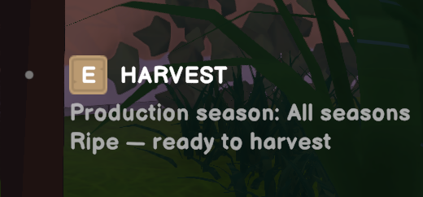

# Tree Harvest Helper

A mod for Old Market Simulator / Old Market Simulator 模组

[English](#english) · [中文](#中文)

## English

In-game acceptance is confirmed by the maintainer. This version is a stable release; see the [validation record](../releases/validation.md).

See when your fruit trees are ready to harvest, directly in the interaction hint.

### Core features

- Show production seasons and harvest readiness when you aim at a planted fruit tree.
- Estimate days remaining from the tree’s actual growth state, assuming daily watering.
- Flag missing watering, inactive seasons and insufficient time before season end.
- Follow all 13 game languages and reuse native season names.

### How to use

1. Enter your town and approach a planted fruit tree.
2. Aim at it within normal interaction range; the extra information appears below the native hint.
3. Read its season, remaining days or ready-to-harvest state. No shortcut or configuration is needed.

Purchased saplings and wild timber trees are excluded. Ripe fruit remains harvestable outside its production season. Estimates assume daily watering and do not change growth.

### Install and remove

[Download 0.1.0](https://github.com/martin-lzh/old-market-simulator-mods/releases/tag/tree-info-v0.1.0). For Old Market Simulator **2.1.6**, Windows x64 / Unity Mono, with **BepInEx 5**. Build and SDK details: [development notes](DEVELOPMENT.md). Changes: [CHANGELOG](CHANGELOG.md).

Exit the game, back up the existing plugin, and put the package's DLL in `BepInEx/plugins/OldMarket.TreeInfo/`. Keep only one active copy. Restart to load it. To roll back, exit and restore the backed-up DLL; to uninstall, remove this plugin's DLL. Keep other plugins, the loader and saves intact. Packages contain only the original DLL, README, CHANGELOG and MIT license.

### Compatibility and testing

The plugin appends local UI text; it does not change saves, watering, harvesting, growth or RPCs. Other players need not install it by design. Missing glyphs, long translated text and competing subtitle changes may affect display. No support for other game versions is established.

Detailed validation and language coverage: [development notes](DEVELOPMENT.md) and [validation record](../releases/validation.md). [MIT License](LICENSE).

## 中文

维护者已确认实机验收完成，本版本为正式发布版，详见[验证记录](../releases/validation.md)。

准星对准果树，就能在交互提示中查看生产季节与成熟时间。

### 核心功能

- 准星对准已种植果树时显示生产季节和成熟状态。
- 按树木实际生长状态估算剩余天数，以每日浇水为前提。
- 提示今日未浇水、本季不生产及季末时间不足。
- 跟随游戏全部 13 种语言，季节名复用原生翻译。

### 怎么操作

1. 进入小镇，走近一棵已经种植的果树。
2. 在正常交互距离内用准星对准树，信息会显示在原生交互提示下方。
3. 查看生产季节、剩余天数或可采收状态，无需快捷键和配置。

购买界面的树苗及野外木材树不显示此信息。成熟果实在非生产季节仍可采收；预测以每日浇水为前提，不改变生长。

### 安装与卸载

[下载 0.1.0](https://github.com/martin-lzh/old-market-simulator-mods/releases/tag/tree-info-v0.1.0)。适用于 Old Market Simulator **2.1.6**、Windows x64 / Unity Mono、**BepInEx 5**。构建与 SDK 见[开发说明](DEVELOPMENT.md)，改动见[版本记录](CHANGELOG.md)。

退出游戏，备份旧插件，将包内 DLL 放入 `BepInEx/plugins/OldMarket.TreeInfo/`，只保留一个启用副本，重新启动游戏加载。回退时退出游戏并恢复备份 DLL；卸载仅删除本插件 DLL，保留其他插件、加载器及存档。包内只含原创 DLL、README、CHANGELOG 和 MIT 许可证。

### 兼容与测试

插件仅追加本地 UI，不修改存档、浇水、采收、生长或 RPC；设计上其他玩家无需安装。可能出现缺字、长译文换行及提示争用，尚未确认其他游戏版本兼容性。

详细测试与语言覆盖见[开发说明](DEVELOPMENT.md)和[验证记录](../releases/validation.md)。[MIT 许可证](LICENSE)。
